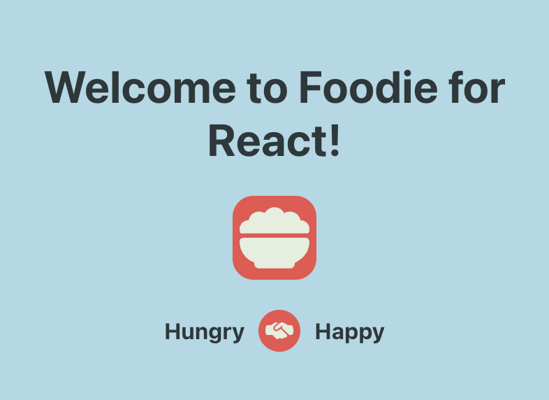
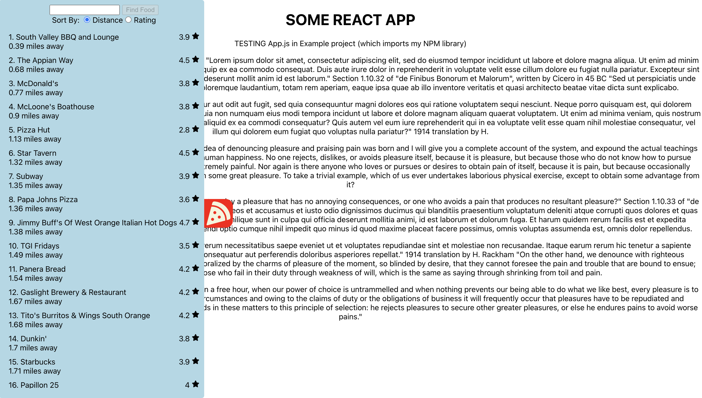
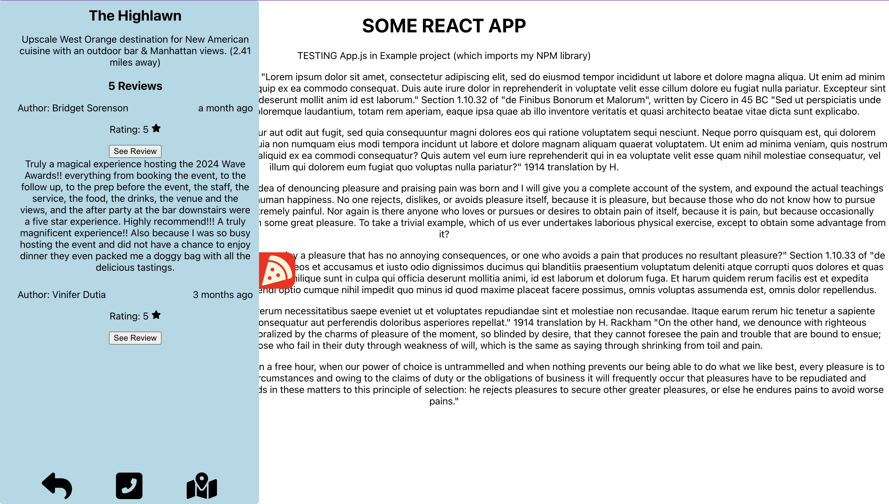

# foodie-react v1.0.13



This is the source code for the upcoming `foodie-react` NPM package: a package that React developers can use to insert an instant restaurant search pane in their app.

A few years ago, I was working with someone who said, "I want you to be able to order Pizza from our app". That encouraged me to come up with [`foodie`](https://www.npmjs.com/package/foodie), the command line interface one can use to find restarants nearby.

Here we are years later, and I am inspired to bring that logic into a genuine user interface. No matter what your React app does, with `foodie-react`, your React app will definitely be able to order pizza-or any cuisine for that matter!

## Installation

```bash
// using NPM
npm install foodie-react

// using yarn
yarn add foodie-react
```

## Usage

```tsx
import "./App.css";
import FoodieReact from "foodie-react";

function App() {
  return (
    <div className="App">
      <h1>SOME REACT APP</h1>
      <p>TESTING App.js in Example project (which imports my NPM library)</p>
      <FoodieReact
        GMapsApiKey={process.env.REACT_APP_GOOGLE_MAPS_API_KEY}
        devPort={process.env.REACT_APP_PORT}
        radius={5000}
      />
    </div>
  );
}

export default App;
```

## Props

| Prop | Type | Required | Default | Description |
|------|------|----------|---------|-------------|
| GMapsApiKey | string | Yes | - | Your Google Maps API key. Required for geocoding and places API functionality. [Get an API key](https://developers.google.com/maps/documentation/javascript/get-api-key) |
| devPort | number | No | 3000 | Port number for development server |
| radius | number | No | 1000 | Search radius in meters for nearby restaurants |

The `FoodieReact` component will automatically start searching for restaurants when the component is mounted. The component will appear as a floating button in the middle-left of the screen. You click it to open the list of restaurants.



Once the list is open, you can search more specifically by typing in the search bar and clicking the "Find Food" button. You can also click on individual restaurants to get more information about them.



## The Local Server

The `server.js` file is a simple Express server that serves as a proxy for the Google Maps API. It is used to fetch data from the Google Maps API and return it to the client so that you can get around the CORS issue. It is not required for the `foodie-react` package to work, but it is required for your project to work locally-unless you have a different proxy setup.

Below is an example of a `server.js` file that you can use to get around the CORS issue.

```js
require("dotenv").config();
const express = require("express");
const axios = require("axios");
const cors = require("cors");

const app = express();
const port = process.env.REACT_APP_PORT;

// Use CORS middleware
app.use(cors());

app.get("/foodie/getAll", async (req, res) => {
  const { latitude, longitude, keyword, radius, key } = req.query;
  const url = `https://maps.googleapis.com/maps/api/place/nearbysearch/json?location=${latitude},${longitude}&radius=${radius}&type=restaurant&keyword=${encodeURIComponent(
    keyword
  )}&key=${key}`;
  try {
    const response = await axios.get(url);
    res.json(response.data);
  } catch (error) {
    console.error(error);
    res.status(500).send("Error fetching data from Google Maps API");
  }
});

app.get("/foodie/getRestaurant", async (req, res) => {
  const { placeid, key } = req.query;
  const url = `https://maps.googleapis.com/maps/api/place/details/json?placeid=${placeid}&key=${key}`;
  try {
    const response = await axios.get(url);
    res.json(response.data);
  } catch (error) {
    console.error(error);
    res.status(500).send("Error fetching data from Google Maps API");
  }
});

app.listen(port, () => {
  console.log(`Server running at http://localhost:${port}`);
});
```

Once you have this server set up, all you need to do is provide a `port` to be used. If no port is provided then `8080` will be used by default. If you have this set up, then `FoodieReact` will work out of the box and before running `npm start` you will need to run `node server.js` to start the server.

## License

This project is licensed under the MIT License - see the [LICENSE](LICENSE) file for details.
